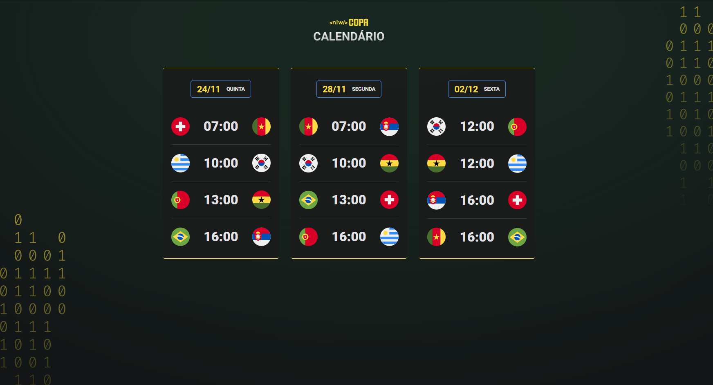

<h1 align="center">
  < NLW-Copa - Trilha Explorer />
</h1>

## :man_artist: Autor

[kaduej](https://github.com/kaduej) :wave:

## :man_teacher: Professor

- **[@Mayk Brito](https://github.com/maykbrito)**

- **[Rockeseat NLW ](https://rseat.in/nlw-edicao-esports)**

## :computer: Descrição
Nesse projeto utilizei:

:point_right: HTML

:point_right: CSS 

:point_right: JavaScript

- Nesse projeto foi proposto criar um site para acesso aos calendários de jogos que pretendo assistir na Copa do Mundo de 2022.
- Através dos ensinamentos do professor fera, *[@Mayk Brito](https://github.com/maykbrito)*, pudemos criar do total zero esse projeto, agradeço a *[🚀@Rocketseat](https://github.com/Rocketseat)* mais uma vez por me proporcionar o aprendizado necessário para melhorar meus conhecimentos na área de programação.

<h2 align="center">
  🚀 Prévia do layout do projeto
</h2>

  

###### :pushpin: Você pode acessa-lo através desse <a href='https://kaduej.github.io/NLW--Copa/'>Link!</a>
###### :pushpin: Você pode acessar o projeto original no Figma através desse <a href='https://www.figma.com/community/file/1169028052212317700'>Link!</a>
